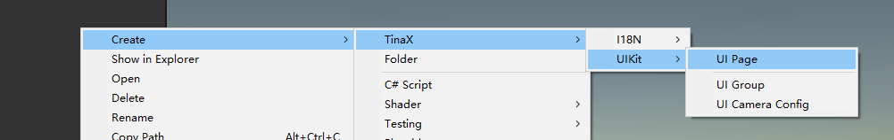
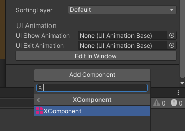
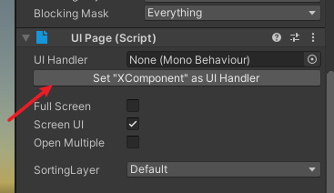
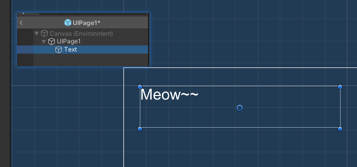
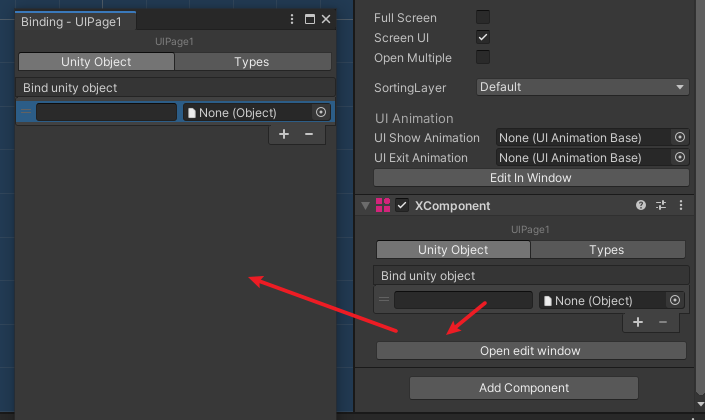
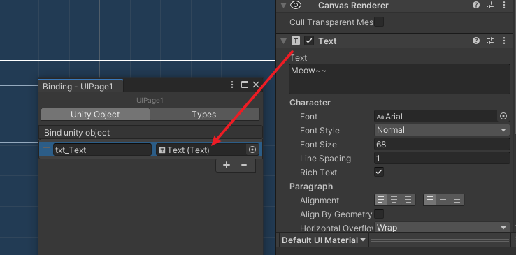

# TinaX Framework - UIKit


[-blue.svg)](https://github.com/996icu/996.ICU/blob/master/LICENSE)
<a href="https://996.icu"></a>
[](https://github.com/yomunsam/TinaX/blob/master/LICENSE)

<!-- [](https://github.com/yomunsam/TinaX/blob/master/LICENSE) -->

TinaX is a Unity-based framework, simple , complete and delightful, ready to use. TinaX provides functionality in the form of "Unity packages". 

`TinaX.UIKit` provides UGUI-based UI management functions for TinaX.

- UI management based on page concept
- UI animation framework
- UGUI function extension

<br>

package name: `io.nekonya.tinax.uikit`

<br>

"Readme" in other languages :

- [简体中文](README_CN.md)

<br>

------

## QuickStart

The main service interface of UIKit:

``` csharp
TinaX.UIKit.IUIKit
```
Facade of the main service interface:

``` csharp
TinaX.VFSKit.UIKit
```

Create a "UI Page"




Add component "XComponent" to root gameObject of "UIPage".



And set as "UI handler"



Add a ugui "Text"



Drag it into "XComponent"





Write a "UIController", (If you think of it as MVC)

``` csharp
using TinaX;
using TinaX.XComponent;
using UnityEngine.UI;

public class MainScreen : XUIBehaviour
{
    [Binding("txt_Text")] //Bind name in "XComponent"
    public Text txt_title;

    public override async void Start()
    {
        txt_title.text = "Hello World(❁´◡`❁)";
    }
}
```

Open UI.

``` csharp 
IUIEntity mainScreen = uikit.OpenUIAsync("mainScreen", new MainScreen());
//The object "uikit" (type: IUIKit) can be obtained through dependency injection. or use facade.
```


For other usages, please read the [documentation](https://tinax.corala.space).

<br>

------

## Install this package

### Install via [openupm](https://openupm.com/)

``` bash
# Install openupm-cli if not installed.
npm install -g openupm-cli
# OR yarn global add openupm-cli

#run install in your project root folder
openupm add io.nekonya.tinax.uikit
```

<br>

### Install via npm (UPM)

Modify `Packages/manifest.json` file in your project, and add the following code before "dependencies" node of this file:

``` json
"scopedRegistries": [
    {
        "name": "TinaX",
        "url": "https://registry.npmjs.org",
        "scopes": [
            "io.nekonya"
        ]
    },
    {
        "name": "package.openupm.com",
        "url": "https://package.openupm.com",
        "scopes": [
            "com.cysharp.unitask",
            "com.neuecc.unirx"
        ]
    }
],
```

If after doing the above, you still cannot find the relevant Packages for TinaX in the "Unity Package Manager" window, You can also try refreshing, restarting the editor, or manually adding the following configuration to "dependencies" node.

``` json
"io.nekonya.tinax.uikit" : "6.6.3"
```

<br>

### Install via git UPM:

You can use the following to install and use this package in UPM GUI.  

```
git://github.com/yomunsam/TinaX.UIKit.git
```

If you want to set a target version, you can use release tag like `#6.6.3`. for detail you can see this page: [https://github.com/yomunsam/TinaX.VFS/releases](https://github.com/yomunsam/TinaX.VFS/releases)


<br><br>
------

## Dependencies

- [com.neuecc.unirx](https://github.com/neuecc/UniRx#upm-package) :`https://github.com/neuecc/UniRx.git?path=Assets/Plugins/UniRx/Scripts`
- [com.cysharp.unitask](https://github.com/Cysharp/UniTask#install-via-git-url) :`https://github.com/Cysharp/UniTask.git?path=src/UniTask/Assets/Plugins/UniTask`
- [io.nekonya.tinax.xcomponent](https://github.com/yomunsam/tinax.xcomponent) :`git://github.com/yomunsam/TinaX.XComponent.git`

> if you install packages by git UPM， You need to install the dependencies manually. Or dependencies will installed automatically by NPM / OpenUPM

<br><br>

------

## Learn TinaX

You can find out how to use the various features of TinaX in the [documentation](https://tinax.corala.space)

------

## Third-Party

The following excellent third-party libraries are used in this project:

- **[TweenRx](https://github.com/fumobox/TweenRx)** : Reactive animation utility for Unity.